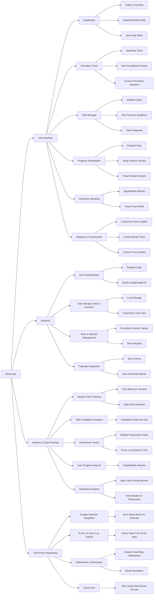

```mermaid
graph LR
    %% Core structure
    A[Study App] --> B[User Interface]
    A --> C[Backend]
    A --> D[Analytics & Data Tracking]
    A --> E[Third-Party Integrations]

    %% User Interface
    B --> B1[Dashboard]
    B --> B2[Pomodoro Timer]
    B --> B3[Task Manager]
    B --> B4[Progress Visualisation]
    B --> B5[Distraction Blocking]
    B --> B6[Settings & Customisation]

    %% Backend
    C --> C1[User Authentication]
    C --> C2[Data Storage Tasks & Sessions]
    C --> C3[Timer & Session Management]
    C --> C4[Calendar Integration]

    %% Analytics & Data Tracking
    D --> D1[Session Time Tracking]
    D --> D2[Task Completion Analytics]
    D --> D3[Productivity Trends]
    D --> D4[User Progress Reports]
    D --> D5[Distraction Analysis]
    
    %% Third-Party Integrations
    E --> E1[Google Calendar Integration]
    E --> E2[To-Do List Sync e.g., Todoist]
    E --> E3[Notifications & Reminders]
    E --> E4[Cloud Sync]

    %% Detailed UI Breakdown
    B1 --> B1a[Today's Overview]
    B1 --> B1b[Weekly/Monthly Stats]
    B1 --> B1c[Upcoming Tasks]
    B2 --> B2a[Start/Stop Timer]
    B2 --> B2b[Set Focus/Break Periods]
    B2 --> B2c[Custom Pomodoro Sessions]
    B3 --> B3a[Add/Edit Tasks]
    B3 --> B3b[Task Priority & Deadlines]
    B3 --> B3c[Task Categories]
    B4 --> B4a[Progress Bars]
    B4 --> B4b[Study Session Streaks]
    B4 --> B4c[Visual Reward System]
    B5 --> B5a[App/Website Blocker]
    B5 --> B5b[Deep Focus Mode]
    B6 --> B6a[Customise Timer Lengths]
    B6 --> B6b[Custom Break Times]
    B6 --> B6c[Choose Focus Modes]

    %% Backend Structure
    C1 --> C1a[Register/Login]
    C1 --> C1b[OAuth Google/Apple ID]
    C2 --> C2a[Local Storage]
    C2 --> C2b[Cloud Sync User Data]
    C3 --> C3a[Pomodoro Session Tracker]
    C3 --> C3b[Timer Restarts]
    C4 --> C4a[Sync Events]
    C4 --> C4b[Auto-Add Study Blocks]

    %% Analytics Breakdown
    D1 --> D1a[Time Spent per Session]
    D1 --> D1b[Daily Study Duration]
    D2 --> D2a[Completed Tasks per Day]
    D3 --> D3a[Weekly Productivity Charts]
    D3 --> D3b[Focus vs Distraction Time]
    D4 --> D4a[Daily/Weekly Reports]
    D5 --> D5a[Apps Used During Session]
    D5 --> D5b[Time Wasted on Distractions]
    
    %% Third-Party Integration Details
    E1 --> E1a[Sync Study Blocks to Calendar]
    E2 --> E2a[Import Tasks from To-Do Apps]
    E3 --> E3a[Session Start/Stop Notifications]
    E3 --> E3b[Break Reminders]
    E4 --> E4a[Sync Study Data Across Devices]

```

