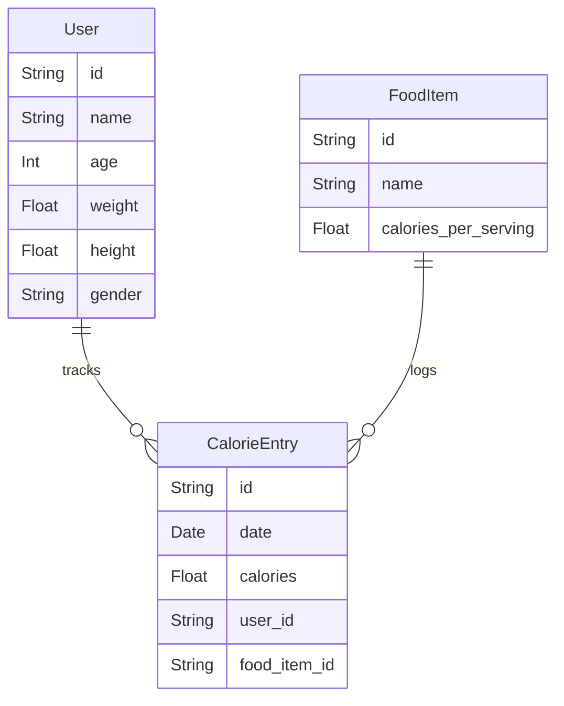

```mermaid
erDiagram
    User {
        String id
        String name
        Int age
        Float weight
        Float height
        String gender
    }

    FoodItem {
        String id
        String name
        Float calories_per_serving
    }

    CalorieEntry {
        String id
        Date date
        Float calories
        String user_id
        String food_item_id
    }

    User ||--o{ CalorieEntry : "tracks"
    FoodItem ||--o{ CalorieEntry : "logs"

```
``

