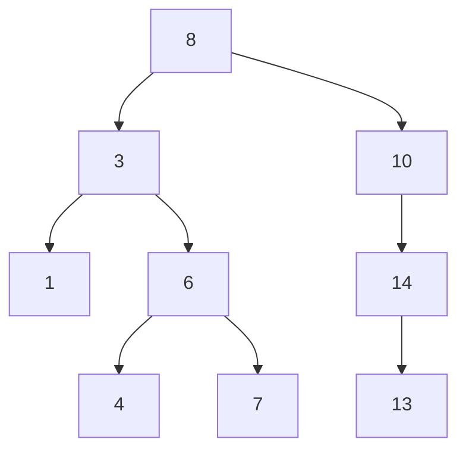

## Question 1

![[Pasted image 20241216221650.png]]![[CleanShot 2024-12-16 at 22.20.51@2x.png]]

A **binary tree** is a way of visualising a data structure.
It is a type of [[tree]]that at most has 2 child nodes.

![[CleanShot 2024-12-16 at 22.22.34@2x.png]]

`EIHCYBQ`

![[CleanShot 2024-12-16 at 23.18.33@2x.png]]
![[CleanShot 2024-12-16 at 23.18.44@2x.png]]

| Current | Pos | Stack[**0**] | Stack[**1**] | Stack[**2**] | Stack[**3**] | Output |
| ------- | --- | ------------ | ------------ | ------------ | ------------ | ------ |
| 0       | 0   | 0            |              |              |              |        |
| 0       | -1  |              |              |              |              | `C`    |
|         | 0   | 4            |              |              |              |        |
|         | 1   |              | 1            |              |              |        |
| 1       | 0   |              |              |              |              | `I`    |
|         | 1   |              | 3            |              |              |        |
|         | 2   |              |              | 2            |              |        |
| 2       | 1   |              |              |              |              | `E`    |
| 3       | 0   |              |              |              |              | `H`    |
| 4       | -1  |              |              |              |              | `B`    |
|         | 0   | 6            |              |              |              |        |
|         | 1   |              | 5            |              |              |        |
| 5       | 0   |              |              |              |              | `Y`    |
| 6       | -1  |              |              |              |              | `Q`    |

![[CleanShot 2024-12-17 at 00.08.12@2x.png]]

A **recursive subroutine** is a subroutine that is defined as calling itself inside of it.

![[CleanShot 2024-12-17 at 00.08.41@2x.png]]

A **base case** in a recursive subroutine is the condition or set of conditions that stops the recursion.

![[CleanShot 2024-12-17 at 00.10.28@2x.png]]

**Return Address** (which is the location in memory where the code will return its data for that recursive call)

**Local Variables** (variables used <u>only locally</u> within the stack frame / recursion)

**** 

## Question 2
![[CleanShot 2024-12-17 at 00.17.43@2x.png]]

`John` -> `Rachel` -> `Paul`

![[CleanShot 2024-12-17 at 00.38.47@2x.png]]

| Time Complexity | Tick one box                    |
| --------------- | ------------------------------- |
| $O(n)$          |                                 |
| $O(log\ n)$     | <marquee>this one lol</marquee> |
| $O(n^2)$        |                         |

![[CleanShot 2024-12-17 at 00.42.31@2x.png]]

Start Index = `1`

| Index | Left Pointer | Data    | Right Pointer |
| ----- | ------------ | ------- | ------------- |
| [1]   | 2            | John    | 3             |
| [2]   | 4            | Hannah  | 5             |
| [3]   | 6            | Racheal | 7             |
| [4]   | -1           | Bradley | -1            |
| [5]   | -1           | Jo      | -1            |
| [6]   | -1           | Paul    | -1            |
| [7]   | -1           | Tina    | -1            |
*Note: what sort of stupid markscheme makes you write `-1` instead of nothing?*

![[CleanShot 2024-12-17 at 09.02.45@2x.png]]

 [[Static data structures]]are immutable, meaning they have a fixed length, and also space in memory. [[Dynamic data structures]], oppositely, can have their lengths changed whenever.
 As well as this, SDS's typically store their data in memory in consecutive / adjacent memory locations, whereas DDS's have pointers in memory to where the next data / value is.

Heap memory refers to the overhead/spare memory allocated at runtime for a DDS, to be used when new items are added/removed etc.

![[CleanShot 2024-12-17 at 12.57.10@2x.png]]
![[CleanShot 2024-12-17 at 13.00.13@2x.png]]

Bradley, Hannah, Jo, John, Paul, Rachel, Tina
*(left side, root, right side)*

![[CleanShot 2024-12-17 at 13.00.37@2x.png]]

The names are in alphabetical order.

![[CleanShot 2024-12-17 at 13.12.31@2x.png]]

It can loop back around / no defined starting point, whereas a tree is defined with a root always.

-----
## Question 3

![[CleanShot 2024-12-17 at 13.24.15@2x.png]]

Contents of the root node: `+`
Contents of all of the leaf nodes: `4`, `9`, `6`

![[CleanShot 2024-12-17 at 13.33.18@2x.png]]

**A:** Node label
**B:** Left child node index
**C:** Right child node index

![[CleanShot 2024-12-17 at 13.50.17@2x.png]]

The node does not have a left child node (therefore max 1 child node).
This is a null pointer.

![[CleanShot 2024-12-17 at 13.52.23@2x.png]]

| Pos | Output |
| --- | ------ |
| [1] |        |
| [2] |        |

![[CleanShot 2024-12-17 at 21.08.27.png]]

`Traverse` goes in order **left**, **right**, and then **parent** therefore uses 

-----
## Question 4

Write down the:
Pre-order
In-order
Post-order

Pre order is **PLR** *(parent, left, right)*
`8 3 1 6 4 7 10 14 13`

In order is LPR (left, parent, right)
`1 3 4 6 7 8 10 13 14`

Post order