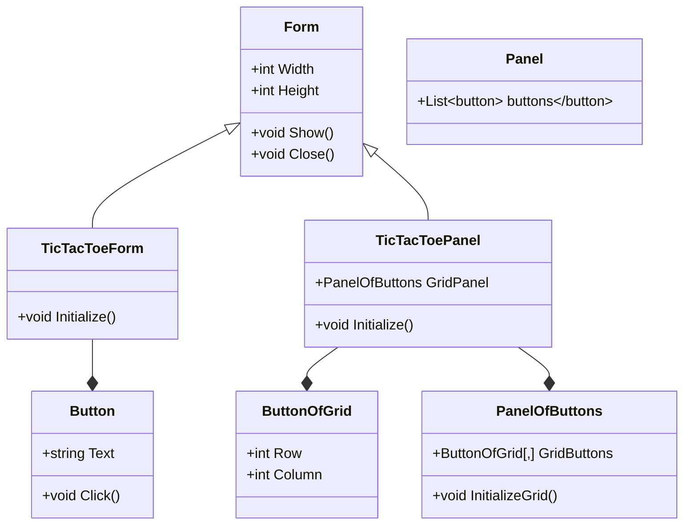

## Instructions

Download the *TicTacToe Object Oriented* version and **create a UML class diagram** that shows the different classes and the relationships between them.

**Classes that should appear in your diagram:**
- Form
- Button
- Panel
- TicTacToeForm
- ButtonOfGrid
- PanelOfButtons
- TicTacToePanel

It needs to show the Inheritance and Association (Aggregation, Composition) relationships.
For each class you should represent the Name, Attributes (Properties) and Methods.

-----

-----
