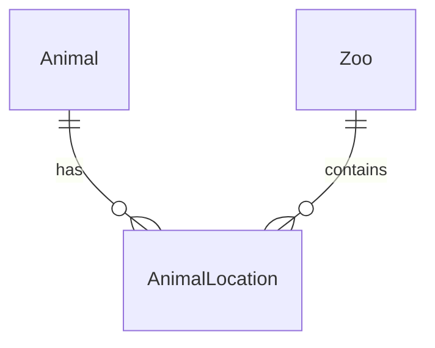

![[CleanShot 2024-09-24 at 23.21.35@2x.png]]

The answer is **B**.
This is because *composite keys* exist, which are allowed in fully normalised databases ([source](https://reddit.com/r/database/comments/2369uc/are_composite_keys_allowed_when_databases_are/)) which consist of two or more attributes.


![[CleanShot 2024-09-24 at 23.25.22@2x.png]]



![[CleanShot 2024-09-25 at 23.35.58@2x.png]]

```sql
CREATE TABLE Animal (
    AnimalID INT PRIMARY KEY,
    InduividualName VARCHAR(50),
    Species VARCHAR(40),
    DateOfBirth DATE,
    Sex VARCHAR(10),
);
```


![[CleanShot 2024-09-25 at 23.36.18@2x.png]]

```sql
SELECT IndividualName, DateArrived
FROM Animal, AnimalLocation
WHERE Animal.AnimalID = AnimalLocation.AnimalID
	AND Species = "Red Panda"
	AND ZooName = "Ashdale Park"
	AND (DateArrived >= 01/04/2020 AND DateLeft <= 31/05/2020)
```


![[CleanShot 2024-09-26 at 00.20.59@2x.png]]

**Advantage:**
	Will be quicker to query / lookup an animal's current location.

**Disadvantage:**
	Introduces data redundancy as `AnimalLocation.ZooName` already exists.

-----

![[CleanShot 2024-09-26 at 00.23.32@2x.png]]

The answer is **B**
idk why